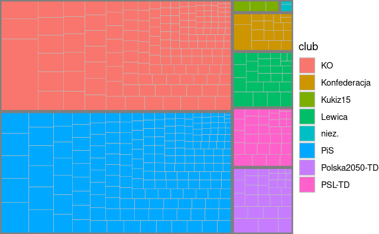

 

  

  <h3 align="center">Analysis of Polish Parliament votings</h3>

  

    Insights into how Polish Parliament works.
    [See It Live!](https://neloduka-sobe.github.io/Sejm-Votings-Analysis/)
  

## About The Project
The idea behind this analysis is to help people understand political body, and make informed decisions on their political choices. It provides insights into general statistics of the Members of Parliament and network analysis of the votings.

### Built With:
    * R
    * Data Visualization
    * Network Analysis
    * Descriptive Statistics

## Contact

[LinkedIn](https://www.linkedin.com/in/borys-langowicz/)

[GitHub](https://github.com/neloduka-sobe)

## Acknowledgements:
    [Polish Parliament API](api.sejm.gov.pl)
